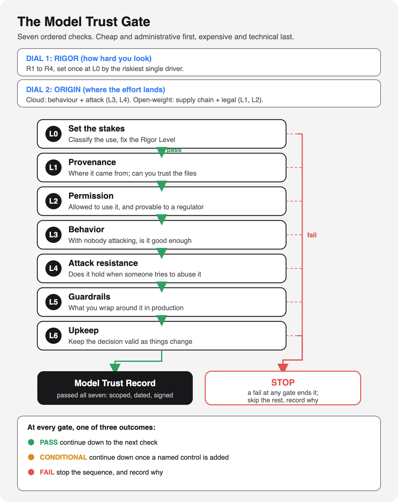

# The Model Trust Gate

*A step-by-step way to decide whether your organization should trust a given AI model, for a specific use, with the right amount of scrutiny and a record you can show an auditor.*

**Status:** working draft (v0.2.1), a personal working document. Facts that still need a primary-source check are tagged `[verify]` in the text.

## The problem

Teams keep adopting AI models: cloud services you call over an API, and open-weight models you download and run yourself. Before each one goes live, someone has to decide whether it is safe enough for the use, and be able to defend that call. That is a hard decision, and an easy one to make inconsistently. The Model Trust Gate turns it into a repeatable procedure, like a vendor-risk or change-approval gate, but for AI models. It ends in a signed, dated **Model Trust Record**.

It does not invent new controls. It composes standards that already exist and arranges them into one runnable decision.

## How to read this repo

Start with the framework, then the validation. When you have an actual model to review, work from the runbook.

- **[FRAMEWORK.md](FRAMEWORK.md)**: the method. Executive summary, the seven-layer gate, Rigor Levels, and the Model Trust Record. **Start here.**
- **[RUNBOOK.md](RUNBOOK.md)**: the method made runnable. A one-page intake, a triage that sets the scrutiny level, a fast track for low-stakes uses, effort sizing, a per-layer checklist, and default pass-bars. **Work from here when a team brings you a model.**
- **[VALIDATION.md](VALIDATION.md)**: how the method holds up, via a coverage crosswalk against the standard risk lists, four worked adoption runs, and an attack on the method itself.
- **[experiments/claim-verification.md](experiments/claim-verification.md)**: a protocol to empirically test the framework's central claim, that self-hosting an open-weight model relocates supply-chain risk onto the adopter.
- **[standards-crosswalk.md](standards-crosswalk.md)**: the control-level backing, each layer mapped to ISO/IEC 42001 clauses and CSA AICM control IDs.

### Run one

- **[templates/model-trust-record.md](templates/model-trust-record.md)**: a fillable Model Trust Record (copy per adoption), with the [JSON schema](templates/model-trust-record.schema.json) for policy-engine gating and two filled-in examples: a [hosted open-weight run](templates/model-trust-record.bedrock-example.json) and a [fine-tuned open-weight run](templates/model-trust-record.fine-tuned-example.json).
- **[runbooks/bedrock-hosted-open-weight.md](runbooks/bedrock-hosted-open-weight.md)**: a full worked run for the most common request, an open model (Qwen, Llama) served through a cloud provider like AWS Bedrock, from intake to signed record.
- **[runbooks/fine-tuned-open-weight.md](runbooks/fine-tuned-open-weight.md)**: the other common case, an open model you fine-tuned in house on your own data. Shows why fine-tuning forks the trust object: reuse the base provenance, redo behavior and attack resistance from scratch.

## The idea in one screen

  

- **A fail-fast gate.** Seven checks run in order, cheap and administrative first, expensive and technical last, so a model that fails an early check is stopped before you spend on the hard testing.
- **Scrutiny matches the stakes.** How hard you look is set by a Rigor Level (R1 to R4), driven by four things: the model's autonomy and agency (the AWS / CSA Agentic AI Security Scoping Matrix), the sensitivity of the data, and the impact of its output on a person or the business.
- **Origin decides where the effort lands.** For a cloud model the work is mostly behavior and attack testing; for a downloaded open-weight model, the supply-chain and legal checks are the hard part.
- **The output is a record, not a score.** A signed, dated Model Trust Record, scoped to one use, with an expiry.

## What it composes

- **Governance:** NIST AI RMF, ISO/IEC 42001, CSA AI Controls Matrix (AICM), EU AI Act.
- **Supply chain:** NIST SP 800-218 (SSDF), SLSA, CSA AICM supply-chain domain.
- **Technical:** OWASP Top 10 for LLM Applications 2026 and OWASP Top 10 for Agentic Applications 2026 (the ASI Top 10, published December 2025), MITRE ATLAS, NIST AI 100-2 E2025 (adversarial-ML taxonomy).
- **Risk classification:** the AWS / CSA Agentic AI Security Scoping Matrix.

## Scope

- Written for the **adopter** of a pretrained model, not the lab that trains one.
- Judges the **model as an adopted component**, not the wider system around it (knowledge bases, multi-agent orchestration, application code), which it hands to a separate system-level review.

---

*Personal working draft. Not affiliated with, nor representing, any employer.*
